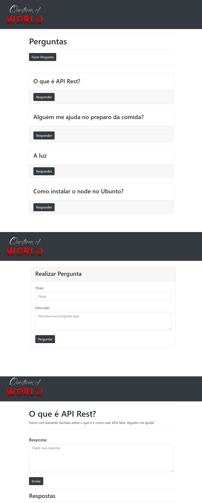

# Questions Of World

## Sobre o projeto.
Site de perguntas e respostas usando banco de dados. Com esse sistema é possível fazer perguntas e responder. Podendo visualizar tudo na página inicial.

Data de conclusão: 23/02/2022

## Ferramentas e tecnologias usadas nesse projeto.
```js    
function QuestionsOfWorld(Project) {
    const Stack = `${HTML}, ${CSS}, ${Bootstrap}, ${EJS}, ${JavaScript}, ${Node.js}, 
    ${Express.js}, ${Sequelize.js}, ${MySQL},`;
};

``` 
<br>

<div align="center">



</div>

---

> - Autores: 
>   - [Eduardo Kayke](https://github.com/EduardoKayke "Perfil do Eduardo")

- [Voltar ao perfil do Github.](https://github.com/EduardoKayke "Perfil do Eduardo")

_Um dia seremos a tecnologia. Biohacking a própria evolução de nós mesmos._